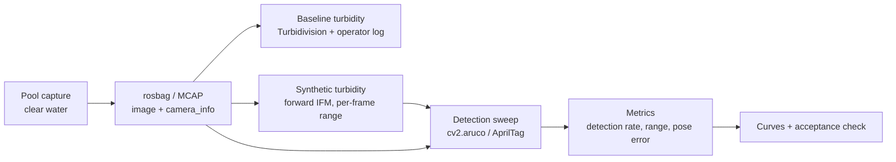

# Underwater ArUco Detection — Experiment Setup & Procedure

**Project:** Vision-based autonomous docking — BlueROV2 Heavy
**Deliverable:** Standalone real-CV validation (offline ArUco detection on real underwater captures)
**Status:** Draft — fill placeholders (`TBD`) during/after the pool session

---

## 1. Objective

Characterise ArUco marker detection and pose-estimation performance on **real underwater footage** as a function of marker size, camera-to-marker range, viewing angle, and water turbidity. The headline output is a **detection-range-and-accuracy curve per marker size and turbidity level**, which (a) validates the perception front-end independently of the docking controller, and (b) quantifies the ArUco range limit that motivates a future far-field cue.

This experiment is decoupled from the docking-controller deliverable: it tests **perception only**, on recorded `rosbag` data, with no closed-loop control.

## 2. Scope & context

- Detection runs **offline** on recorded bags — the pool session only captures data.
- Live capture uses **one lens of the stereo camera** (monocular ArUco, known marker size).
- Turbidity in a public pool cannot be altered, so turbidity is handled by (i) a measured **clear-water baseline** and (ii) an **offline synthetic turbidity sweep**, optionally anchored by a few real dosed points.

## 3. Questions under test

1. What is the maximum reliable detection range for each marker size?
2. How do detection rate and pose error degrade with range, angle, and turbidity?
3. Does the multi-marker fused pose remain valid where individual markers drop out?
4. (Comparison) How do grid densities (4×4 / 5×5 / 6×6) and AprilTag compare on range vs angle?

---

## 4. Equipment & materials

| Item | Detail | Notes |
|---|---|---|
| Vehicle | BlueROV2 Heavy | Stationary or slow-moving; capture only |
| Camera | One lens of onboard stereo camera | Monocular; record `/camera/image_raw`, `/camera/camera_info` |
| Marker target | Matte acrylic ArUco collage | Matte to suppress glare; acrylic for rigidity/water-safety |
| Dictionary | `TBD` (see §5) | Generate + detect with the **same** library |
| Recording | ROS 2 `rosbag` (MCAP) | Raw image + camera_info topics |
| Ranging reference | Tape measure / surveyed marks | Ground truth for range and pose accuracy |
| Turbidity (baseline) | Turbidivision (FNU) + pool operator log | Image-based estimate + traceable cross-check |
| Turbidity (added) | Offline IFM synthesis (Jerlov types) | Optional real dosed points (milk/clay) in a separate vessel |
| Lighting | `TBD` (ambient / onboard light) | Lock and record |

## 5. Marker target specification

Marker layout and sizes from `dock_layout.py` / `aruco.launch.py`. Print sizes are **total print dimensions**; the detector measures the black square only (ratio 1470/1889 = 0.7782).

| ID | Print size (mm) | Black-square (m) | Position role |
|---|---|---|---|
| 201 | 200 | 0.15564 | Front-wing plate, left |
| 202 | 200 | 0.15564 | Front-wing plate, right |
| 301 | 100 | 0.07782 | Backplate cluster, bottom |
| 302 | 60 | 0.04669 | Backplate corner, top-left |
| 303 | 60 | 0.04669 | Backplate corner, top-right |
| 304 | 60 | 0.04669 | Backplate corner, bottom-right |
| 305 | 60 | 0.04669 | Backplate corner, bottom-left |
| 401 | 47.5 | 0.03696 | Cluster, top-left |
| 402 | 47.5 | 0.03696 | Cluster, top-right |

**Dictionary decision (open):** currently the original ArUco dictionary (5×5 grid, minimum Hamming distance ≈ 1 → weak error correction). Candidate upgrade: a strong-distance 5×5 set (OpenCV `DICT_5X5_1000`, or `ARUCO_MIP_25h7` in the aruco library) — same grid density, stronger error correction. **Generation and detection must use the same library** (OpenCV `cv2.aruco` ≠ Muñoz-Salinas `aruco_ros` dictionaries). Caliper-measure printed markers and record actual side lengths before the run.

---

## 6. Variables

### 6.1 Independent (swept)

| Variable | Levels (planned) | Notes |
|---|---|---|
| Range $d$ | 0.5, 1, 1.5, 2, 3, 4, 5 m (until failure) | Primary sweep |
| Marker size | 200 / 100 / 60 / 47.5 mm | Coupled with range |
| Turbidity | Clear baseline + synthetic Jerlov levels | See §7 |
| Viewing angle | 0°, 20°, 40° | Yaw/pitch off-axis |
| Dictionary/grid (comparison) | 4×4 / 5×5 / 6×6 + AprilTag | Offline only |
| Lighting | Ambient / onboard | If feasible |

### 6.2 Controlled (fixed and recorded)

| Variable | Setting | Why |
|---|---|---|
| Camera intrinsics | In-water/behind-port calibration | Pose error invalid otherwise |
| Exposure / gain / WB | Locked (no auto) | Auto-exposure confounds turbidity |
| Resolution / frame rate | `TBD` | Affects pixel budget |
| Printed marker side length | Caliper-measured | True size ≠ nominal |
| Detector + params | Dictionary, threshold window, refinement, EC rate | Reproducibility |
| Turbidity measurement | FNU class + method | Per segment |
| Rig geometry | Surveyed standoffs | Ground truth |

### 6.3 Dependent (measured)

| Metric | Symbol/unit | Type |
|---|---|---|
| Detection rate | % frames detected | Quantitative |
| Maximum detection range | m | Quantitative |
| Min detectable apparent size | px | Quantitative |
| Translation error | mm or % of range | Quantitative |
| Rotation error | deg | Quantitative |
| Pose precision (jitter) | std over static frames | Quantitative |
| Noise-vs-range coefficient | $\alpha$ (fitted) | Quantitative |
| ID error / false-positive rate | % | Quantitative |
| Reprojection error | px | Quantitative |
| Angular detection limit | deg | Quantitative |
| Failure modes | description | Qualitative |
| Pose ambiguity / flips | description | Qualitative |
| Multi-marker recovery | description | Qualitative |
| Filter behaviour on real data | description | Qualitative |

---

## 7. Turbidity strategy

### 7.1 Baseline (clear pool)

- A chlorinated pool sits near the clear extreme; do **not** force a Jerlov coastal class.
- Estimate baseline with **Turbidivision** (image-based, FNU). Expect the lowest class (FNU 0–10) — confirms "clear", coarse resolution only.
- Cross-check with the **pool operator's logged turbidity** (regulated, traceable) where available.
- Capture baseline frames at fixed exposure/framing for reproducibility.

### 7.2 Synthetic turbidity (offline forward synthesis)

Degrade the clear frames with the simplified underwater image-formation model (atmospheric-scattering form), using per-frame range $d(x)$ from the marker pose:

$$
I_c(x) = J_c(x)\, e^{-\beta_c\, d(x)} + B_c\left(1 - e^{-\beta_c\, d(x)}\right)
$$

- $c \in \{R,G,B\}$; $\beta_c$ = per-channel attenuation; $B_c$ = backscatter/veiling light.
- Parameterise $\beta_c$ by **Jerlov water types** for named, defensible levels.
- Reference (physically accurate): the **Akkaynak–Treibitz revised model**, with separate direct ($\beta^D$) and backscatter ($\beta^B$) coefficients:

$$
I_c(x) = J_c(x)\, e^{-\beta_c^{D}\, d} + B_c^{\infty}\left(1 - e^{-\beta_c^{B}\, d}\right)
$$

### 7.3 Optional real dosed points (calibration)

In a **separate vessel** (never the pool): dose with kaolin/bentonite clay or antacid/milk, measure FNU, run a few short-range captures. Use these to calibrate the synthetic $\beta \leftrightarrow$ FNU mapping.

---

## 8. Data pipeline

---

## 9. Procedure

### 9.1 Pre-dive prep
1. Finalise dictionary; generate and **verify a printed sample decodes** in the detector.
2. Fabricate matte-acrylic collage; caliper-measure each marker.
3. Confirm capture topics and lock camera settings (exposure/gain/WB).

### 9.2 Calibration
4. Run in-water (behind-port) intrinsic calibration; save and record the calibration file.

### 9.3 Baseline turbidity
5. Capture fixed-exposure baseline frames; run Turbidivision; record FNU class.
6. Request operator turbidity reading for the session date.

### 9.4 Recording runs
7. For each (range × size × angle): hold static for a fixed dwell (≥ `N` s / `M` frames), record range from tape/survey, log segment in §12.2.
8. Repeat key points for variance.

### 9.5 Offline processing & synthesis
9. Extract frames; build synthetic-turbidity sets per Jerlov level (§7.2).

### 9.6 Detection sweep
10. Run detection per dictionary (and AprilTag) across all conditions; export per-frame detections + pose.
11. Compute metrics (§10); fill results tables (§12); check acceptance (§11).

---

## 10. Metrics & definitions

- **Detection rate** = detected frames / total frames at a condition.
- **Max detection range** = largest $d$ with detection rate above threshold.
- **Min detectable apparent size** = marker pixel width at the detection threshold; sanity-check against the pixel-budget rule $\text{px} \approx 3\,(n+2)$ for an $n\times n$ grid.
- **Accuracy** = error vs ground-truth pose (bias + RMSE). **Precision** = std over static frames.
- **Noise model:** position $\sigma_{pos} = \alpha\, r^2 / s$ and rotation $\sigma_{rot} = \alpha\, r / s$ (range $r$, marker size $s$). Fit $\alpha$ from measured jitter and check the functional form.
- **ID error rate** = detections with wrong ID / total detections.

---

## 11. Acceptance criteria

### Quantitative

| Criterion | Threshold | Basis |
|---|---|---|
| Detection rate in operational envelope | ≥ 90% from ≤ 0.5 m inward | COARSE→FINE handoff (`#32`) |
| Position precision at ≤ 0.5 m | std < 0.02 m | `HEALTHY_MAX_POSITION_STD_M` |
| Rotation consistency | within 8° | `consensus_threshold_deg` |
| Pose accuracy at engagement (< 0.5 m) | trans < ~2 cm, yaw < few° | FINE convergence |
| Mis-ID / false-positive rate | ≈ 0 | Docking target integrity |
| Max-range curve per size | characterised + plotted | Deliverable |

### Qualitative

- Catalogue failure modes at the range limit (contrast loss, backscatter halo, blur, glare, occlusion, FOV exit).
- Note pose-flip ambiguity at low angles and whether multi-marker fusion suppresses it.
- Detection stability near the limit (flicker vs clean cutoff).
- Multi-marker recovery when individual markers drop.
- Filter behaviour on real data (Mahalanobis gate rejecting good detections? covariance inflation?).

---

## 12. Data recording templates

### 12.1 Calibration record

| Field | Value |
|---|---|
| Date | `TBD` |
| Camera / lens | `TBD` |
| Resolution | `TBD` |
| fx, fy | `TBD` |
| cx, cy | `TBD` |
| Distortion model + coeffs | `TBD` |
| Reprojection error (px) | `TBD` |
| In-water / behind-port? | `TBD` |

### 12.2 Run log

| Run | Marker IDs | Size (mm) | Range (m) | Angle (°) | Lighting | Frames | Bag file | Notes |
|---|---|---|---|---|---|---|---|---|
| 1 | | | | | | | | |
| 2 | | | | | | | | |

### 12.3 Baseline turbidity log

| Source | Value | Units | Time | Notes |
|---|---|---|---|---|
| Turbidivision | | FNU class | | |
| Pool operator log | | NTU/FNU | | |
| Estimated $\beta$ (from range fit) | | per channel | | optional |

### 12.4 Results — detection rate (per condition)

| Size (mm) | Turbidity | Range (m) | Angle (°) | Dict | Detection rate (%) | Frames |
|---|---|---|---|---|---|---|
| | | | | | | |

### 12.5 Results — maximum detection range

| Size (mm) | Turbidity | Dict | Max range (m) | Min apparent size (px) |
|---|---|---|---|---|
| | | | | |

### 12.6 Results — pose error (per condition)

| Size (mm) | Range (m) | Turbidity | Trans bias (mm) | Trans RMSE (mm) | Rot RMSE (°) | Pos jitter std (mm) | Reproj err (px) |
|---|---|---|---|---|---|---|---|
| | | | | | | | |

### 12.7 Failure-mode log

| Condition | Observed failure | Suspected cause | Frame ref |
|---|---|---|---|
| | | | |

---

## 13. Appendix — references

- D. dos Santos Cesar et al., *An evaluation of artificial fiducial markers in underwater environments* (fiducial comparison across turbidity/lighting).
- *Docking and Persistent Operations for a Resident Underwater Vehicle*, arXiv:2602.16360 (grid-size study: 5×5 best range/detection, 4×4 better at oblique angles).
- *SonarSweep*, arXiv:2511.00392 (IFM turbidity synthesis from clear images using Jerlov water types).
- *DeepTurbid: Underwater marker detection and pose estimation in turbid conditions* (IFM-based marker image synthesis + detection-robustness evaluation).
- D. Akkaynak & T. Treibitz, *A Revised Underwater Image Formation Model* (CVPR 2018) and *Sea-thru* (CVPR 2019).
- Turbidivision (`YellowTeamRobot/AI_Turbidity_Honors2023-4`) — image-based FNU turbidity estimation.
